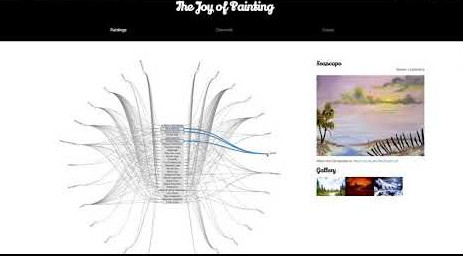

# Bob Ross - The Joy of Painting

Project in Data visualization course. Created by Lara Wietschorke, Robin Clerc and Kristina Satara at EPFL Lausanne in December 2017. 

Inspired by instructional television program "The Joy of the Painting" created and hosted by Bob Ross,we want to visualize the data about his paintings created during this 11-year television show. During 403 episodes Bob Ross painted 381 works.The basic dataset comes from fivethirtyeight website and is created by exploring each episode and painting in particular.

During the research we discovered the website TwoInchBrush(http://www.twoinchbrush.com/) which contains a database of all links to pictures of Bob's paintings, the link to each episode on YouTube as well as a matrix of the used colours per painting and paintings made by guests. Special thanks to the owner of the website Felix Auer, who has shared his database with us.

Project site: https://mssquirrel.github.io/data_viz_project/

Watch the video: 

